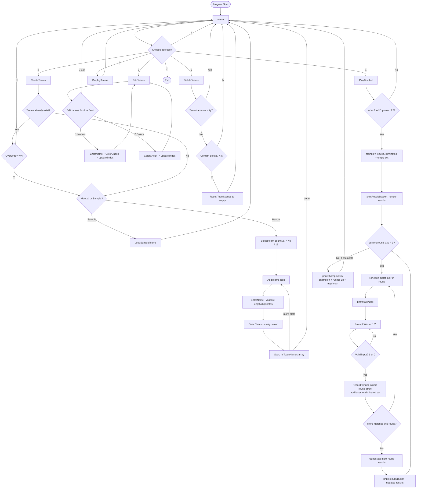

# Display.java — Program Logic Flowchart

## Notes on the diagram

- Every branch loops back to `Menu`, matching the actual code: each top-level action (`PlayBracket`, `CreateTeams`, `EditTeams`, `DisplayTeams`, `DeleteTeams`) returns control to the `do...while` loop in `menu()`.
- `buildResultBracket()`'s internal recursion (splitting the team range in half, rendering connectors, merging left/right subtrees) is collapsed into the single `printResultBracket` boxes above — it's called after every round to redraw the whole tree with newly-known results.
- The **bug noted in the disclosure/explanation docs** — `menu()`'s case `5` falling through into case `6` (`DeleteTeams`) because of a missing `break` — is not shown here, since this diagram represents the *intended* logic rather than that specific fall-through defect.
