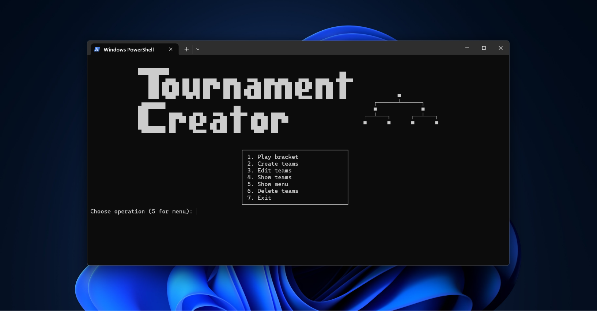
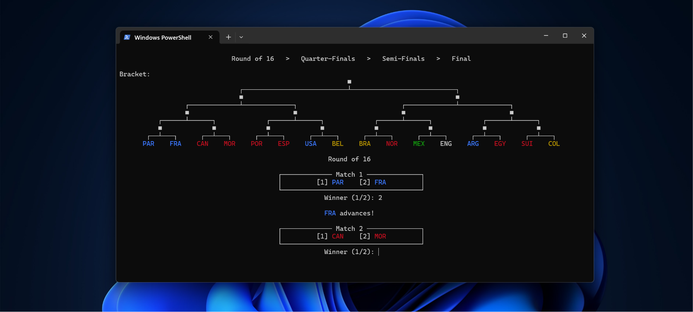
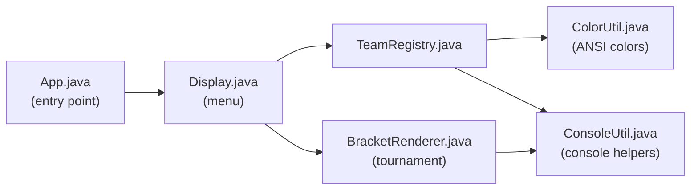

<div align="center">

# Football Tournament Creator

**A colorful, ASCII-art single-elimination bracket simulator right in your terminal.**

Create teams, pick winners round by round, and watch a live bracket tree redraw itself
until a champion is crowned.

[](https://www.oracle.com/java/technologies/downloads/)
[](#-getting-started)
[](#-getting-started)
[](#)
[](#-ai-assistance-disclosure)

<sub>Built for the AUPP Java Programming course · Summer 2026</sub>

</div>


---

## Table of Contents

- [Features](#-features)
- [Demo](#-demo)
- [Getting Started](#-getting-started)
- [How to Play](#-how-to-play)
- [Project Structure](#-project-structure)
- [Architecture](#-architecture)
- [Documentation](#-documentation)
- [AI Assistance Disclosure](#-ai-assistance-disclosure)

---

## Features

| | |
|---|---|
| 🎨 **Colored teams** | Assign each team an ANSI color (red, yellow, green, blue, purple) so they're easy to track through the bracket |
| 🌳 **Live ASCII bracket tree** | The full tournament tree redraws itself after every round, with connectors and winners filled in |
| ⚡ **Any power-of-two size** | Run a bracket of 2, 4, 8, or 16 teams |
| 🧪 **Sample teams** | Load a ready-made 16-team list instantly to demo the app without typing |
| ✏️ **Full team management** | Create, edit (name or color), and delete your team list at any time |
| 🚫 **Elimination tracking** | Knocked-out teams are greyed out and struck through in the bracket view |
| 🏆 **Champion banner** | A trophy screen with the winner, runner-up, and match stats caps off every run |
| 🖥️ **Responsive layout** | Detects your real terminal width so menus, boxes, and the bracket stay centered |
| 📦 **Zero dependencies** | Pure Java standard library — no build tool or external package required |

---

# App Preview


---

## Getting Started

### Prerequisites
- **JDK 17+** (uses text blocks and `switch` expressions)
- A terminal that supports ANSI escape codes (Windows Terminal, PowerShell, macOS Terminal, most Linux shells)

### Clone & Run

```bash
git clone https://github.com/itspanha01/Football-Tournament-Creator.git
cd Football-Tournament-Creator/src

# Compile
javac App.java Display.java TeamRegistry.java BracketRenderer.java ConsoleUtil.java ColorUtil.java

# Run
java App
```

Or just open the project in **IntelliJ IDEA** and run `App.java` directly.

---

## How to Play

1. **Create teams** (option `2`) — enter 2, 4, 8, or 16 teams manually, or load the sample list.
2. **Assign a color** to each team as you go.
3. **Play the bracket** (option `1`) — pick a winner for every match; the bracket redraws after each round.
4. Watch the tree narrow down — Quarter-Finals → Semi-Finals → Final.
5. The last team standing gets the **champion trophy screen** 🏆.
6. Use **Edit** / **Delete** (options `3`, `6`) anytime to tweak your team list between runs.

---

## Project Structure

```
Football Tournament Creator/
├── src/
│   ├── App.java              # Entry point — starts the program
│   ├── Display.java           # Main menu: draws it, routes user choices
│   ├── TeamRegistry.java       # Team CRUD: create, edit, delete, display
│   ├── BracketRenderer.java   # Tournament engine: matches + ASCII bracket tree
│   ├── ConsoleUtil.java       # Shared console helpers (width, padding, centering)
│   └── ColorUtil.java         # ANSI color wrapping for team names
├── Docs/
│   ├── Beginner_Explanation.md      # Plain-language walkthrough of every file
│   ├── Display_explanation.md      # Line-by-line reference notes
│   ├── Display_logic_flowchart.md  # Mermaid flowchart of the full program flow
│   └── AI_Assistance_Disclosure.md # What was hand-written vs. AI-assisted
└── README.md
```

---

## Architecture

Each class has exactly one job — a pattern called **separation of concerns**:



The bracket itself is drawn with **recursion**: `BracketRenderer` splits the team list in
half repeatedly, renders each half, then stitches the two sides together with a connector
line and the match winner — until it bottoms out at a single team.

---

## Documentation

| Doc | What's in it |
|---|---|
| [`Display_explanation.md`](Docs/Display_explanation.md) | Detailed line-by-line reference notes |
| [`Display_logic_flowchart.md`](Docs/Display_logic_flowchart.md) | Mermaid flowchart of the menu → team → bracket flow |
| [`AI_Assistance_Disclosure.md`](Docs/AI_Assistance_Disclosure.md) | Transparency note on hand-written vs. AI-assisted code |

---

## AI Assistance Disclosure

Parts of this project (notably the recursive bracket renderer and terminal-width detection)
were built with AI assistance. See
[`Docs/AI_Assistance_Disclosure.md`](Docs/AI_Assistance_Disclosure.md) for the full,
line-by-line breakdown of what was hand-written versus AI-assisted.

---

## Contributors

<a href="https://github.com/itspanha01/Football-Tournament-Creator/graphs/contributors">
  
</a>

---

<div align="center">
<sub>Made by Sopanha · AUPP Java Programming, Summer 2026</sub>
</div>
